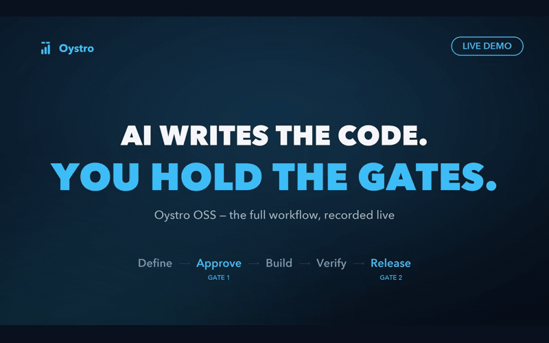

# oystro-oss

**A full-lifecycle software engineering protocol for AI coding agents.**

One protocol. Any agent. Any project. From big picture to shipped feature — with human gates,
structured templates, and explicit phase transitions for large BRDs.

> This repository is the **protocol reference**: conventions, templates, command contracts, and
> personas. The **runtime** that executes and enforces the workflow — prerequisite checks,
> evidence capture, dashboards, memory/migrations, and skill installation — is the **Oystro
> engine** (paid offering).

---

## Quickstart

Open your AI agent in your project directory and paste this:

```
read https://github.com/oystro/oystro-oss/blob/main/commands/init.md and follow the instructions to initialize oystro-oss in this folder
```

| Folder state | What the agent does |
|--------------|---------------------|
| **Empty** | Asks questions, builds requirements from conversation |
| **Existing code** | Reverse-engineers BRD, constitution, architecture |
| **PRD + ADR ready** | Derives all documents from existing docs |
| **Has .oystro-oss/** | Refreshes the protocol reference, preserves customizations |



---

## Protocol vs runtime

| Capability | This repo (oystro-oss) | Oystro engine (paid) |
|---|---|---|
| Workflow, templates, gates, personas | Yes | Yes |
| Command contracts (reference) | Yes | Yes |
| Deterministic gate enforcement | — | Yes |
| Evidence capture and verification | — | Yes |
| Status dashboard and approvals | — | Yes |
| Memory, project graph, migrations | — | Yes |
| Skill selection and installation | — | Yes |
| Multi-project / team workflows | — | Yes |

The protocol is a **file-based convention**, not a tool dependency. It works whether you use
Claude, Copilot, or Cursor. The runtime is what makes it dependable.

---

## The Workflow

The core philosophy is a bounded agent loop: agents work autonomously, and human gates stop
them until a person approves.

```text
/oystro:init → /oystro:define → [Human Gate 1: /oystro:approve] → /oystro:build
        → [/oystro:review-pre-verify — L only] → /oystro:verify → [Human Gate 2: /oystro:release]
```

Design and tasks are internalised by `/oystro:define` into a single `spec.yaml`; there are no separate
design or tasks commands.

### Commands

Read the command contracts from `commands/` (installed projects: `.oystro-oss/commands/`).

| Command | Logical Role | What happens | Gate |
|---------|--------------|-------------|------|
| `/oystro:init` | Manager | Scan docs, derive constitution/BRD/architecture, plan phases | — |
| `/oystro:define` | Analyst | Create `spec.yaml` from the BRD, including design and tasks | — |
| `/oystro:approve` | Gatekeeper | **Human Gate 1** — approve the spec/design before build | Human |
| `/oystro:build` | Developer | Implement against the approved Evidence Contract — one commit per task | — |
| `/oystro:review-pre-verify` | Sr Tech Lead | Fresh-context review of build against the contract (**L only**) | Agent review |
| `/oystro:verify` | Gatekeeper | Run approved evidence, check acceptance criteria, write verification | — |
| `/oystro:release` | Gatekeeper | **Human Gate 2** — disclose deferred, merge, archive, update status | Human |
| `/oystro:change` | Developer | Unified bug and CR workflow: baseline → smallest delta → verify | — |
| `/oystro:status` | Manager | Project state snapshot (provided by the Oystro engine) | — |
| `/oystro:upgrade` | Manager | Refresh the protocol reference; hand state to the paid product | — |

> Command names and the `/oystro:` prefix are shared with the Oystro engine and remain stable.

---

## What Gets Created

```
your-project/
├── AGENTS.md                    ← agent workflow rules
│
└── .oystro-oss/
    ├── CONSTITUTION.md          ← principles and rules (never overwritten)
    ├── BRD.md                   ← business requirements (never overwritten)
    ├── ARCHITECTURE.md          ← system design (never overwritten)
    ├── technology.yaml          ← toolchain + tech decisions (never overwritten)
    ├── SLICE_LOG.md             ← build narrative
    ├── commands/                ← workflow command contracts
    ├── agents/                  ← persona definitions
    ├── templates/               ← feature and big-picture templates
    ├── skills/                  ← conditionally installed maintained skills (project copy)
    │
    ├── phases/
    │   ├── active/<phase>/features/<feature>/
    │   └── archive/<phase>/
    └── specs/
        ├── active/              ← CRs and changes
        └── done/                ← released CRs and changes
```

---

## Gates

There are **two human gates**, plus an optional agent review for L-level projects. The Oystro
engine enforces them deterministically; without the engine, the human is the enforcement point.

1. **Human Gate 1 — `/oystro:approve`** (before build): the human approves `Ref: APPROVED` on the
   spec/design produced by `/oystro:define`. Nothing may be implemented before this.
2. **Human Gate 2 — `/oystro:release`** (after verify): the human approves `Release Ref: APPROVED`,
   deferred items are disclosed, then the work is merged. Cannot proceed without explicit approval.

**Agent review (not a human gate) — `/oystro:review-pre-verify`**: a Sr Tech Lead fresh-context review
of the build against the spec. It applies to **L-level projects only**; S and M skip it.

Quality comes from:
- **Templates** — constrain LLM output with structure
- **Constitution** — principles the agent must follow
- **Evidence contract** — the minimum proof required per change, enforced by the Oystro engine

---

## Git Branching

```
main                               ← protected
  ├── feature/<FID>-<slug>        ← /oystro:define
  ├── change/CHG-NNN-<slug>       ← /oystro:change
  └── hotfix/<id>-<slug>          ← emergency fix against main
```

Commit convention: `type(ID): description`

PR Rules:
- **Feature → Main**: `feat(<FID>): <title> [VERIFIED]`
- **Change → Main**: `fix(CHG-NNN): <title> [VERIFIED]`
- **Hotfix → Main**: `hotfix(HOT-NNN): <title> [P0]`

---

## Skills

Skills are installed conditionally on demand, never as a monolithic bundle or complete registry dump.
At project initialization and during feature definition, the agent assesses the detected technology
stack and task needs, selecting only the necessary maintained skills from
[`oystro-oss-skills`](https://github.com/oystro/oystro-oss-skills). Maintained skills are
maintainer-owned and overwritten on upgrade, while project-specific corrections live in the
local project copy (`.oystro-oss/skills/<name>/SKILL.md`).

---

## Security & Pre-Commit Setup

To prevent accidental secret leaks, configure the repository git hooks:
```bash
git config core.hooksPath githooks
```
This activates `githooks/pre-commit` to deterministically block sensitive filenames and run `gitleaks protect --staged`.

---

## License

Copyright (c) 2026 Oystro Technologies. See [NOTICE](NOTICE).

Licensed under the GNU Affero General Public License v3.0 only (`AGPL-3.0-only`). See [LICENSE](LICENSE).

See [DISCLAIMER.md](DISCLAIMER.md) for the warranty and liability disclaimer.
